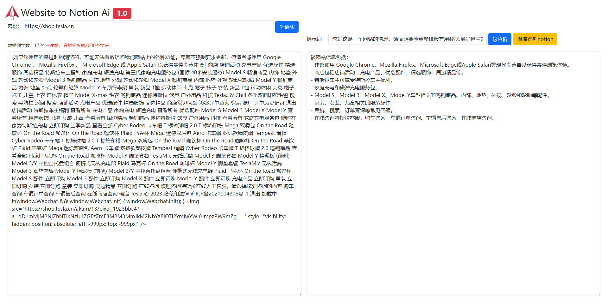

<!--
 * @Author: Mr_Yaoo 2316718372@qq.com
 * @Date: 2023-06-05 14:57:25
 * @LastEditors: Mr_Yaoo 2316718372@qq.com
 * @LastEditTime: 2023-06-05 14:59:05
 * @FilePath: \Website-to-notion-ai\README.md
 * @Description: 这是默认设置,请设置`customMade`, 打开koroFileHeader查看配置 进行设置: https://github.com/OBKoro1/koro1FileHeader/wiki/%E9%85%8D%E7%BD%AE
-->
注意：该网站需要使用到GPT和Notion服务，请确保你的网站能够正常访问！
该网站仅支持个人学习不得从事任何盈利项目，违者必究！

## 准备工作 ##

1. 修改.env 环境变量

    1.1 NOTION_TOKE获取 [https://www.notion.so/my-integrations](https://www.notion.so/my-integrations)

    1.2 PARENT_ID获取 创建笔记后 
        复制url [https://www.notion.so/e302e95bf9494b83ad123456789](https://www.notion.so/e302e95bf9494b83ad123456789)
        e302e95bf9494b83ad123456789就表示PARENT_ID，在此之前你需要
        将当前页面开启NOTION_TOKE服务权限

        1.2.1 开通页面NOTION_TOKE服务权限
            进入notion笔记后点击右上角三个点（...）滑动到最底部
            点击+Add connections 选择你创建的NOTION_TOKE服务

    1.3 GPTKEY获取 注册完成chatGPT后，你可以点击该链接获取
        [https://platform.openai.com/account/api-keys](https://platform.openai.com/account/api-keys)

## 运行项目 ##

项目运行环境 node V 14

1. 安装依赖 npm install

2. 启动项目 node app.js
   控制台打印：Server listening at http://localhost:3001
   表示运行成功，可去往浏览器访问：[http://localhost:3001](http://localhost:3001)

## 主要功能描述 ##

1. 用户可以给定一个网站地址进行网站信息获取

2. 将获取后的信息+提示词使用GPT进行过滤总结

3. 一键保存到Notion笔记中
   3.1 新建 或者 插入

## 项目展示 ##

# Website-to-notion-ai

